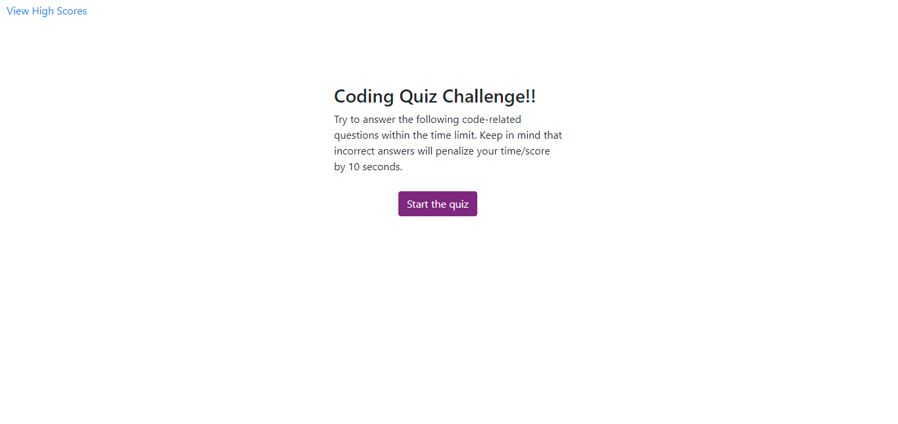
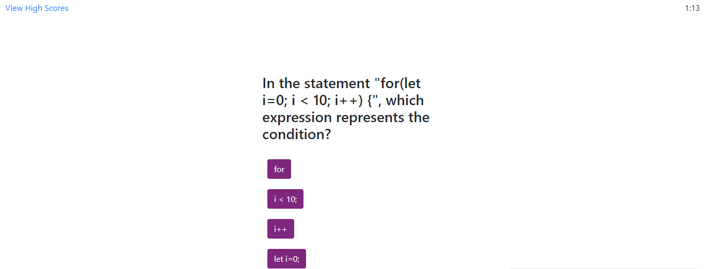
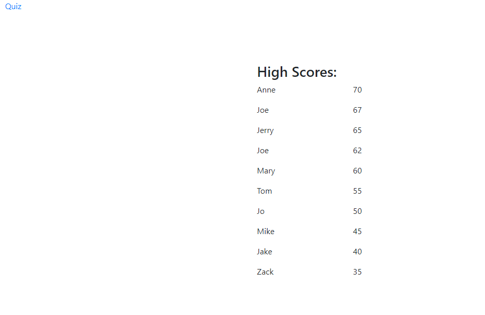
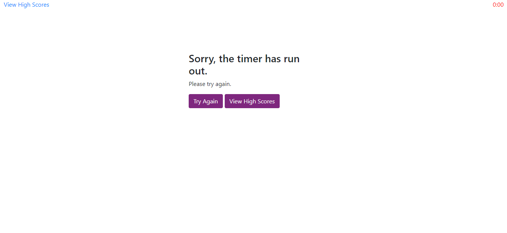

# Read Me
## Coding Quiz

This repo contains code for a coding quiz. Please see [this page](dvorakjt.github.io/codingQuiz/) for the deployed version of the quiz.
> Written with [StackEdit](https://stackedit.io/).

## Basic Functionality
### Start Screen
Upon initial load, the page displays a header, a description of the quiz, a start button, and a link to view high scores. The high scores are loaded, or, if none have been saved yet, placeholder names and scores are initialized.

If the use clicks the Start the Quiz button, several things happen:

- First, the page is wiped clean of everything except the link to view the high scores.
- Then, a timer is initialized, and a question is loaded.
### The Quiz

**Features:**
- A total of five questions are asked.
- Questions are drawn randomly from a question bank. No question will be asked twice in the same round.
- If the user gets a question correct, the message "Correct!" briefly displays in green text on the screen, and the next question is loaded to the screen.
- If the user gets a question wrong, the message "Incorrect. Time - 10" briefly displays in red text to the screen. If this causes the user to run out of time, they are directed to a screen that informs them that they are out of time. 2 buttons are drawn to the screen that link back to the quiz homepage, and the high scores page, respectively.
- If the user runs out of time due to the timer ticking down (and not due to answering a question incorrectly), the same behavior initiates.
- If the user answers all questions without the timer running out, their score is evaluated against an array of high scores. If it is greater than any of them, it is spliced into the array at that point, and the last element of the array is deleted using pop(). The array is then Stringify-ed and saved to localStorage, and the user is redirected to the high scores page.
### High Scores Page

**Features:**
- The scores page utilizes the same general layout as the home page. 
- The HTML is simple, only featuring a link back to the home page, and a header.
- The rest of the HTML is generated by a separate script file, because it seemed more efficient to use a for loop to generate all the requisite columns and rows, as well as to simultaneously populate them with the high scores.
- The high scores page loads the high scores that were saved to local storage by the quiz, so even when the page is closed, refreshed, or left, the same scores remain.
## Process
For this assignment, I set out to use Bootstrap and CSS to imitate the look of the example gif we were given as closely as possible. To that end, I opened up Boostrap's CSS file and found the formatting for the ".btn-primary" class so I could use my own CSS file to format the buttons to change their color scheme to match that of the example we were given.

From there, I got the start page working, and got it to load and display one question, and gradually added functionality until the page loaded multiple questions from a bank, evaluated the user's input, and saved high scores.

My last task was to expand the bank of questions to 10 in total, and have the script randomly select from this bank (while not repeating questions during the same quiz).

## Code Highlights
**Manipulating the DOM**

One of the focal points of this project was dynamically updating the HTML. To accomplish this, I used jQuery. An example of this is the code used to load a question, found in the assets/script.js file, between lines 136 and 165. 

    var  newQuestion = $("<h3>"); //some code omitted here in this example
    newQuestion.text(questions[randQ].qText);
    $("#headerAndQText").append(newQuestion);
    for (let  i = 0; i < questions[randQ].qAnswers.length; i++) {
    const  answer = $("<button>");
    var  lineBreak = $(" ");
    answer.attr("type", "button");
    answer.attr("class", "btn btn-primary");
    answer.css("margin", "10px");
    answer.attr("data-type", "ansBtn");
    answer.text(questions[randQ].qAnswers[i]);
    if (i === questions[randQ].qRightAnswer) {
    answer.attr("data-eval", "correct");
    }
    else {
    answer.attr("data-eval", "incorrect");
    }
    $("#buttonsDiv").append(answer);
    $("#buttonsDiv").append(lineBreak);
    }
    currentQ++;

After generating a random question number (more on that later), this code assigns text to the newQuestion header based on the random question object's text. It appends this text to the #headerAndQText div by using the jQuery method `$("#id").append`.
from there, it uses a for loop to create buttons for each of the answers in the question object's qAnswers property. It assigns them an attribute called "data-eval" which tells the page whether that answer is correct or not. Finally, the currentQ (current quiz question) variable is incremented. Such manipulation of the DOM is found throughout this program.
**Saving to and Loading from Local Storage**

    var  highScores = JSON.parse(localStorage.getItem("hsArr"));
    var  highScoreNames = JSON.parse(localStorage.getItem("hsnArr"));
    //if local storage data doesn't exist, make up some names and scores.
    if (!highScores) {highScoreNames = ["Anne", "Jerry", "Mary", "Tom", "Jo", "Mike", "Jake", "Zack", "Matt", "Steve"];
    highScores = [70, 65, 60, 55, 50, 45, 40, 35, 30, 25];
    }
When the page loads, the highScores and highScoreNames are loaded from local storage. JSON.parse is used to convert them from Strings to arrays. If they haven't been saved yet, they will be set to null. 

Because null is a falsy, it evaluates to false when used in a Boolean evaluation. Therefore if(!highScores) returns true if highScores have not yet been saved to local storage, and sets some placeholder names and scores to each array. The high scores page behaves in the same way.

When the user completes the quiz, a function is called that evaluates if they have beat any of the high scores.

    function  checkHighScores(score) {
	    for (let  i = 0; i < highScores.length; i++) { 
		    if (score > highScores[i]) { 
			    myRank = i;
			    highScores.splice(i, 0, score);
			    highScoreNames.splice(i, 0, "Placeholder");
			    highScores.pop();
			    highScoreNames.pop();
			    return;
		    }
	    }
    }
  This function uses a for loop to check each of the high scores against the user's score. It begins with the highest score and works down. If the user's score is higher than one of the high scores, it sets the users rank to that score's rank, splices in the user's score and name into their respective arrays, deletes the last item in the high scores array, and calls return to exit the function (this is important because, it would continue to check the user's score against all other scores, and `score > highScores[i]` would continue to evaluate to true).

Then, if the user's rank is 9 or greater, the user has placed in the top 10, and a form is generated for them to input their name. The placeholder is replaced with their name, and the highScores and highScoreNames arrays are saved as Strings to local storage.

**The Timer**

The timer uses the setInterval callback function to tick down. This code is pretty straightforward, but I wanted to draw your attention to the time displayed to the user. The actual variable time is initialized to 75 seconds. The user, however, sees 1:15. This is accomplished by dividing the time by 60 and rounding down with Math.floor() to get the minutes. The seconds are determined by using modulus ( % ) 60 to determine what the remainder of dividing by 60 would be. If this value is less than 10, it is converted to a string, and a preceding "0" is concatenated with it. The minutes and seconds values are then both concatenated with ":" in between.

**Drawing from a Random Bank of Questions**

Instead of simply looping through the same 5 questions, I wanted  to build in the capability to randomly select questions from a bank of questions (which could easily be added to). The first step was declaring a questions[]; array. each element of this array is an object which contains a quiz question, an array of answers, and the index number of the correct answer.

	 
	var randQ;
	do {
		randQ = Math.floor(Math.random() * questions.length);
    } while (askedQuestions.includes(randQ))
    askedQuestions[currentQ] = randQ;

The loadQuestion() function begins by declaring a variable called randQ. a do-while loop then randomly picks an index number from questions, and continues to re-roll if that index number can be found in the askedQuestions[] array. If it hasn't, it sets an askedQuestions index to the random value so that question will not be asked again.